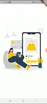

## About The Project
Flutter Ecommerce App using GraphQl API

### GraphQL
   GraphQL is an open-source data query and manipulation language for APIs, and a runtime for fulfilling queries with existing data. GraphQL was developed internally by Facebook in 2012 before being publicly released in 2015.


### GraphQl Plugin for Flutter
   ```sh
   graphql_flutter: ^5.0.0
   ``` 
  

### App Demo



### GraphQl Open-Source API
    Ecommerce site:  https://saleor.io/  
    API : https://demo.saleor.io/graphql/
 

 
## Getting Started

This project is a starting point for a Flutter application.

A few resources to get you started if this is your first Flutter project:

- [Lab: Write your first Flutter app](https://flutter.dev/docs/get-started/codelab)
- [Cookbook: Useful Flutter samples](https://flutter.dev/docs/cookbook)

For help getting started with Flutter, view our
[online documentation](https://flutter.dev/docs), which offers tutorials,
samples, guidance on mobile development, and a full API reference.

